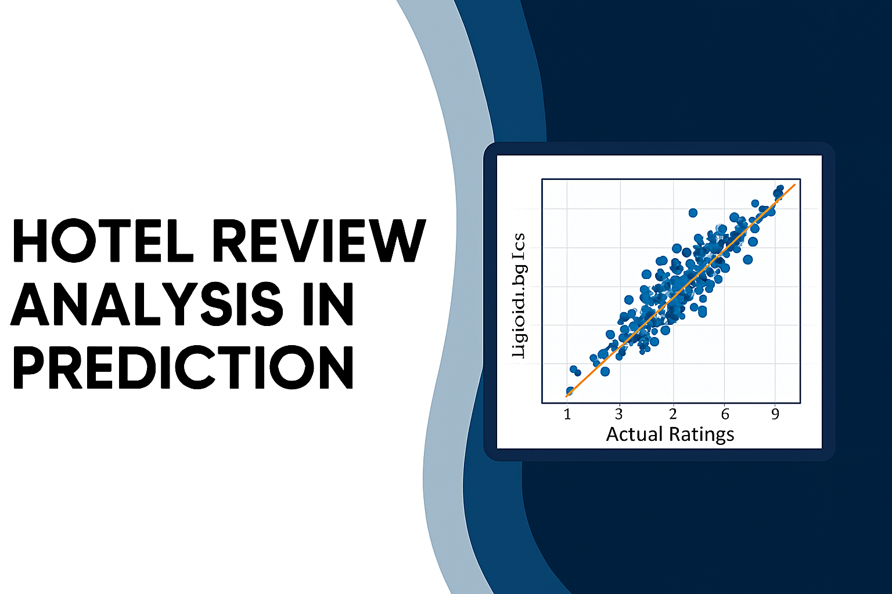
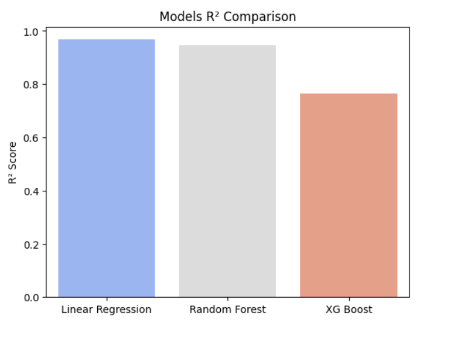
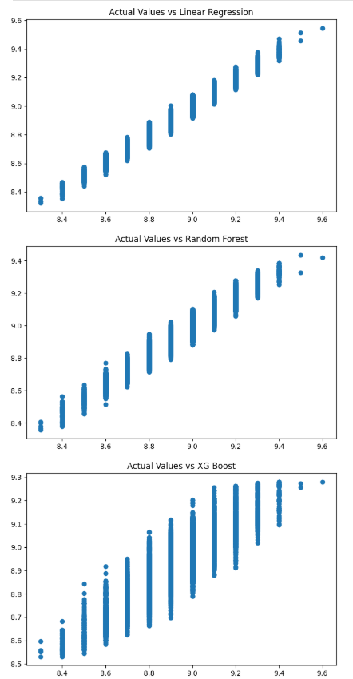

<p align="center">
  
</p>

# Hotel Review Analysis & Score Prediction

[](./hotel_review_analysis_prediction.ipynb)
[]()
[]()

---

## Table of Contents

- [Overview](#-overview)
- [Key Results](#-key-results)
- [Visual Results](#-visual-results)
- [Project Structure](#-project-structure)
- [Getting Started](#-getting-started)
  - [Requirements](#-requirements)
  - [Run the Notebook](#-run-the-notebook)
- [Reproducibility & Recommended Workflow](#-reproducibility--recommended-workflow)
- [Suggestions for Improvement](#-suggestions-for-improvement)
- [Acknowledgments](#-acknowledgments)
- [License](#-license)
- [Contact](#-contact)

---

## Overview

**Hotel Review Analysis & Score Prediction** is a reproducible data science project that explores hotel, review, and user metadata to predict an overall review score (`score_overall`). The project combines exploratory data analysis (EDA), feature engineering, and supervised regression models to compare performance and produce a deployable prediction pipeline.

The notebook demonstrates:
- Data ingestion and merging of hotel, review, and user datasets
- EDA (distributions, relationships, correlation heatmaps)
- Preprocessing and feature scaling
- Model training and evaluation (Linear Regression, Random Forest, XGBoost)
- Visualization of model performance and prediction diagnostics

> Note: The current notebook version does not yet use review text for prediction. A high-impact next step is to include NLP features (TF-IDF or transformer embeddings) for improved predictive power.

---

## Key results

| Model                | R² Score  | RMSE       |
|---------------------:|:---------:|:----------:|
| Linear Regression    | 0.96736   | 0.03319    |
| Random Forest        | 0.94641   | 0.04253    |
| XGBoost (XGBRF)      | 0.76461   | 0.08914    |

(Results above were computed on a single train/test split — see *Reproducibility* and *Improvements* sections for recommended validation procedures.)

---

## Visual Results

You can showcase one or two of your model performance plots here for better presentation.  
For example:

**R² Comparison:**



**Predicted vs Actual Scatter Plot:**



---

## Project structure

| Path | Description |
|------|-------------|
| `Hotel_Review_Analysis_and_Prediction.ipynb` | Main notebook for data preprocessing, exploratory analysis, and regression modeling. |
| `assets/` | Contains visual assets such as plots and thumbnails used in documentation and presentation. |
| `data/` | Placeholder for raw and processed datasets. Excluded from version control to protect privacy and support reproducibility. |
| `README.md` | Provides a structured project overview, setup instructions, and documentation for reviewers and collaborators. |
| `requirements.txt` | Defines Python dependencies to ensure consistent environment setup and reproducible results. |
| `.gitignore` | Specifies files and directories to exclude from Git tracking, maintaining a clean and focused repository. |


---

## Getting started

### Requirements

Create a virtual environment and install dependencies:

```bash
python -m venv .venv
source .venv/bin/activate        # macOS / Linux
# .venv\Scripts\activate         # Windows

pip install -r requirements.txt
```

### Run the notebook

1. Place the CSV files in the `data/` directory:
 - `data/hotels.csv`
 - `data/reviews.csv`
 - `data/users.csv`

2. Launch Jupyter:
```bash
jupyter notebook
# or
jupyter lab
```

3. Open `hotel_review_analysis_prediction.ipynb` and run cells from top to bottom.

---

## Reproducibility & recommended workflow

To improve reproducibility and production-readiness:

- Break the notebook into modular scripts under `src/`:
  - `src/data_preprocessing.py`
  - `src/features.py`
  - `src/train.py`
  - `src/evaluate.py`
  - `src/infer.py`

- Use `sklearn.pipeline.Pipeline` to encapsulate preprocessing + model.
- Replace single train/test split with **k-fold cross-validation** (e.g., `KFold` or `StratifiedKFold` depending on data).
- Use `RandomizedSearchCV` or `GridSearchCV` for hyperparameter tuning.
- Persist the final pipeline with `joblib.dump()` (add sample code to `src/inference.py`).
- Add unit tests for critical functions in `tests/` and configure CI (GitHub Actions).

---

## Suggestions for improvement

1. **Include NLP features**: use TF-IDF or transformer embeddings on `review_text`. This is likely to increase performance significantly.
2. **Feature importance & interpretability**: compute permutation importance or SHAP values to explain model predictions.
3. **Model serving / demo**: add a simple Flask/FastAPI demo that accepts sample review metadata + text and returns a predicted score.
4. **Data versioning**: consider DVC or another solution for dataset version control if the dataset evolves.
5. **Documentation & examples**: include a short `examples/` folder with sample inference calls.

---

## Acknowledgments

- **Dataset Source:**  
  This project uses hotel review, user, and hotel metadata from the provided dataset files (`hotels.csv`, `reviews.csv`, `users.csv`).  
  If this dataset originated from a public source such as [Kaggle](https://www.kaggle.com/), please credit it here appropriately.  
  Example:  
  > Dataset adapted from *[Hotel Reviews Dataset – Kaggle](https://www.kaggle.com/datasets/alperenmyung/international-hotel-booking-analytics)* (accessed 2025).

- **Tools & Libraries:**  
  - Python (pandas, numpy, matplotlib, seaborn, scikit-learn, xgboost)  
  - Jupyter Notebook  
  - Joblib (for model persistence)

- **Special Thanks:**  
  Gratitude to the open-source community and data science educators who promote best practices in data analysis, reproducibility, and machine learning development.

---

## License

This project is released under the **MIT License**. See [`LICENSE`](LICENSE) for details.

---

## Contact

Author: *Arian Jr* — [My GitHub](https://github.com/ArianJr)

---

<p align="center">
  Made with ❤️ by <a href="https://github.com/ArianJr" target="_blank">ArianJr</a>
</p>

<p align="center">
  <sub>⭐ If you found this project useful, please consider giving it a star! It helps others discover it and supports my work.</sub>
</p>

---

<p align="center">
  
  
</p>


